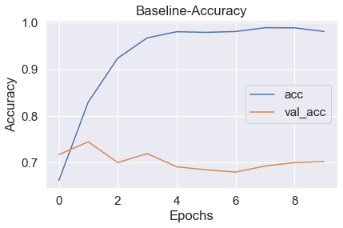
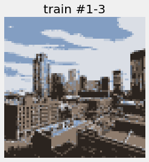

# Landscape Image Classification
  Using convolutional neural networks to classify images into their respective category.
## Table of Contents
  1. [Goal](https://github.com/Joshua-Hill-Science/Landscapes/blob/main/README.md#goal)
  2. [Data](https://github.com/Joshua-Hill-Science/Landscapes/blob/main/README.md#Data)
  3. [Models](https://github.com/Joshua-Hill-Science/Landscapes/blob/main/README.md#Models)
## Goal
The goal of this project is to be able to input a landscape image into a model and have it predict if the image contains:
* Buildings
* Forests
* Glaciers
* Mountains
* Seas
* Streets
  
 To do this we implement a convolutional neural network that looks for patterns in the images. 
 

 A cnn applies a filter of weights to an input that allows the net to better pick up on important features in the images. 
 
 
 
 ## Data
 The data for this project consists of 17,034 images of different landscapes split into training and testing sets. 
 
 The dataset can be found on kaggle [here](https://www.kaggle.com/puneet6060/intel-image-classification).
 
 ## Models
 
 We tried making many different models using images of different sizes and color compression.
 
 ### Baseline Model
 
 The baseline model was made from only images compressed from 150 pixels square to 75 pixels square. This model overfit the training data a lot so it was obvious that some regularization would be needed. Here is a plot of the training and validation accuracy:
 
 
 
 The big difference between training and validation accuracy shows overfitting to the training data.
 
 ### Final Model
 
 Our final model used images that were compressed to 75 pixels square and had compressed color data. Here is an example of a before and after compressing:
 

 

 
 The final model has an accuracy of about 70% on the testing data that it has not seen before.
 
 We also used LIME to visualize how the model makes decisions. Below is an example of an original image, the LIME explainer image, and the models predictions. The green on the LIME image shows parts of the image that positively affect the model accuracy and the red negatively affects the model.
 
 
 
 
 

  
 

 
