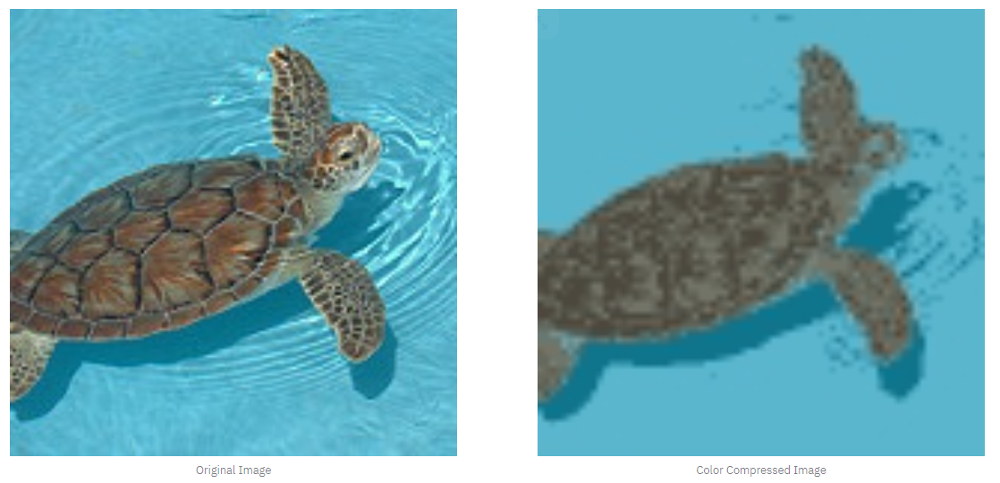

# Josh's Jupyter Notebooks

## 

Here I explored the data. Using Kaggle user Vincee loading code {https://www.kaggle.com/vincee/intel-image-classification-cnn-keras} I was able to convert image files into Numpy arrays. This allowed me to write a function that took the K-Nearest Neighbors cluster for each pixels color, average them and return an image.

This code was shared with Warren and Ross to allow them to improve their models as they saw fit.

## 

Here I tested that I could load in the saved color compressed images then using Numpy then ran a baseline model using Warren's Code. From here I requested to work on the Website Deployment and let my partners finish the modeling hypertuning, please refer to Warren and Ross's Notebooks for more details.
