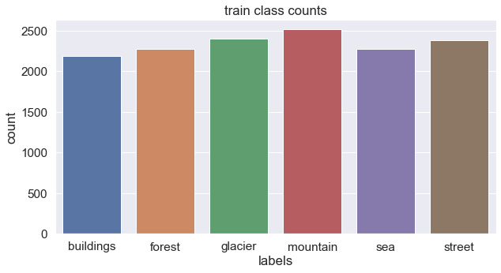

# Warren

I did a lot of modeling for the group and used LIME and a model explainer to further understand how to make changes. I started with some initial EDA in the EDA notebook and looked at class balances. They were mostly even in the training and testing sets. Here is an example plot showing that:

In the model iterations notebook, I tested many different models for five epochs at a time. I slowly narrowed down a good set of layers and regularization to use thought there is still a lot of room for improvement.

I got LIME working in the notebook called Lime and made some fuctions to output explainers. 

In modelscoring, I evaluated every model that I had made and picked the one that performed the best. 

Next, colorcompmodels combines the best performing model with the color compressed images that Josh worked on. There were some more tweaks to the regularization to finalize the model. 

I had some more time after finalizing the preseentation and readmes so I decided to try making some more models using less compression in the notebook called lesscompression. I settled on 8 K Clusters for color istead of 4 and scaled the pictures to 100 pixels square instead of 75. Initial tests did not show a significant difference so I tried some more complex models. I looked up some model architectures that researchers have found work well for image classification. After making the mst basic model, I got resource errors. I was expecting this and I scaled now the model to have around 30 million trainable parameters and only 4 convolutional layers. I was still getting errors so I reduced the number of features until there were about 10 million parameters. This seems like the best I can do running on a cpu and still have reasonable training times. I added regularization, dropout, and trained larger batch sizes. I was able to do a little better with a validation accuracy of about 78% with some overfitting.

The next step is to figure out gpu support so that I can train faster. That would also increase the number of parameters that I can use.